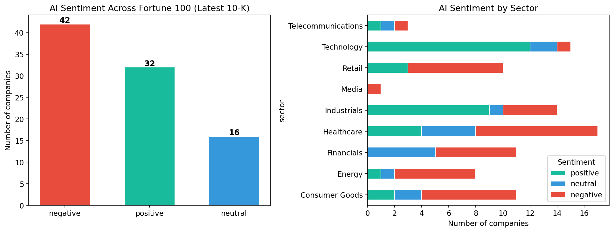

## The question

Artificial intelligence is everywhere in corporate discourse. Earnings calls, investor presentations, and annual reports are saturated with references to AI, machine learning, and generative models. But what are companies actually saying when they write about AI in the document that carries the most legal weight -- the annual 10-K filing?

We analyzed the most recent 10-K filing for each Fortune 100 company to answer a specific question: **when America's largest public companies discuss AI in their regulatory disclosures, do they frame it as an opportunity or a risk?**

The answer is striking, and carries implications for how investors should interpret corporate AI narratives.

## Scope

- **Universe:** Fortune 100 companies by revenue. Of these, 94 are public filers with retrievable 10-K filings from SEC EDGAR.
- **Filings:** The single most recent 10-K per company (filing dates range from early 2025 to February 2026).
- **Method:** We extracted passages from each 10-K that contain AI-related terms (artificial intelligence, machine learning, deep learning, generative AI, predictive models, and related phrases), then classified the sentiment of those passages and identified the dominant theme of each company's AI discussion.

## Finding 1: AI is now a near-universal disclosure topic

Of the 94 Fortune 100 companies with retrievable filings, **90 (96%) mention artificial intelligence** or closely related terms in their latest 10-K. This is no longer a technology-sector phenomenon. Companies across healthcare, energy, retail, financials, and industrials are all addressing AI in their annual reports.

The four companies without any AI-related language in their filings are the exception, not the rule. The question for investors is no longer *whether* a company mentions AI, but *how* it frames the technology.

## Finding 2: The majority frame AI as a risk

This is the headline result. Among the 90 companies that discuss AI:

| Sentiment | Companies | Share |
|-----------|-----------|-------|
| Negative (risk-focused) | 42 | 47% |
| Positive (opportunity-focused) | 32 | 36% |
| Neutral (factual) | 16 | 18% |

**Nearly half of Fortune 100 companies frame AI primarily as a risk** in their most recent 10-K. The language is dominated by regulatory uncertainty, cybersecurity threats, compliance costs, and competitive disruption. Positive framing -- AI as a strategic asset, growth driver, or source of competitive advantage -- accounts for just over a third.

This is a meaningful signal. The 10-K is a legally binding document reviewed by counsel. The language in it reflects what management and legal teams believe they need to disclose to investors. When the dominant framing is risk, it tells us that the corporate reality of AI adoption -- at least as seen through the lens of regulatory disclosure -- is more cautious than the narrative on earnings calls and in investor presentations.

## Finding 3: Sector determines the narrative

The sentiment split is not uniform across industries. Technology companies are a clear outlier: the vast majority frame AI positively, emphasizing competitive positioning, product innovation, and strategic investment. This is expected -- these are the companies building and selling AI.

The pattern reverses in nearly every other sector:

- **Financials** lean heavily negative, with banks and insurers focusing on cybersecurity risk, regulatory compliance, and the operational uncertainties of deploying AI in regulated environments. JPMorgan Chase, Bank of America, Citigroup, and Morgan Stanley all classify as negative or cautious.
- **Healthcare** is mixed but tilts negative, with pharmaceutical and insurance companies emphasizing regulatory risk, while providers like HCA Healthcare and CVS Health frame AI as an operational efficiency tool.
- **Industrials** are split. Defense contractors like Lockheed Martin and Northrop Grumman see AI as a competitive asset. General manufacturers like 3M and General Electric frame it primarily as a risk.
- **Retail** leans negative, with companies like Target, Kroger, Home Depot, and Dollar General emphasizing the risks of AI-driven competition and cybersecurity exposure.
- **Energy** is predominantly negative, focused on cybersecurity and operational risk, with the notable exception of Chevron, which frames AI as a productivity tool.

The implication for investors: **the same technology is being framed as opportunity or threat depending on whether a company is a builder of AI or a consumer of it.**

## Finding 4: Risk and regulation dominate the thematic landscape

Beyond sentiment, we classified the primary theme of each company's AI discussion. The results reinforce the risk-first framing:

| Primary AI Theme | Companies |
|------------------|-----------|
| Risk and regulation | 47 |
| Competitive positioning | 19 |
| Operational efficiency | 10 |
| Investment and capex | 5 |
| Product innovation | 3 |
| Data and analytics | 3 |
| Customer experience | 2 |
| Talent and workforce | 1 |

**Over half of all Fortune 100 companies that mention AI do so primarily in the context of risk and regulation.** This includes cybersecurity threats amplified by AI, evolving regulatory frameworks (particularly around data privacy and algorithmic accountability), and the competitive risk of falling behind on AI adoption.

Competitive positioning is a distant second, driven almost entirely by technology companies. Operational efficiency -- the use case that arguably delivers the most near-term enterprise value -- ranks third.

## Finding 5: AI intensity varies enormously

The depth of AI discussion varies dramatically across the Fortune 100. Some companies dedicate extensive passages to AI strategy, risk management, and investment plans. Others mention it once in passing.

The most AI-vocal companies by keyword density include Sysco (which discusses AI extensively in the context of operational transformation), Northrop Grumman (AI as a defense capability), Target (AI as a competitive and regulatory risk), HCA Healthcare (AI-driven care delivery), and Capital One (AI in financial services with significant regulatory framing).

At the other end, companies like ExxonMobil, Plains All American Pipeline, and Caterpillar mention AI only once or twice, typically in a general risk factor or market demand context.

## What this means for investors and operators

Several implications emerge from this analysis:

**The disclosure gap is a signal.** When a company frames AI exclusively as a risk in its 10-K but touts it as a growth driver on earnings calls, that gap is worth investigating. The 10-K is the more conservative, legally scrutinized document. Investors should weight it accordingly.

**Sector context matters.** A negative AI sentiment score for a bank is not the same signal as a negative score for a technology company. Financial services firms operate under regulatory frameworks that compel cautious disclosure language. The risk framing may reflect compliance culture as much as genuine strategic concern.

**Builders vs. consumers.** The clearest pattern in the data is the divide between companies that build AI products (technology firms, which are overwhelmingly positive) and companies that consume AI tools (everyone else, which skew negative or neutral). This divide has direct implications for where AI-driven value creation will accrue and where AI-driven risk will concentrate.

**The regulatory overhang is real.** The dominance of "risk and regulation" as the primary AI theme is not just disclosure boilerplate. It reflects genuine uncertainty about how AI will be regulated, how liability will be allocated, and how compliance costs will scale. Companies are telling investors, in legally binding language, that they do not yet know the rules of the game.

**Operational efficiency is underdisclosed.** Only 10 companies identify operational efficiency as their primary AI theme, despite this being the use case with the most immediate and measurable impact on margins. This suggests either that operational AI adoption is earlier-stage than the public narrative implies, or that companies are not yet comfortable claiming AI-driven efficiency gains in a document subject to SEC scrutiny.

---

*This analysis covers the Fortune 100 by revenue. Of these, 94 companies had retrievable 10-K filings from SEC EDGAR. Sentiment was classified using natural language processing applied to AI-specific passages extracted from each filing. The full analysis is reproducible from the notebook in this repository.*
