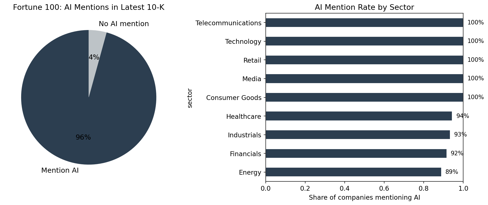
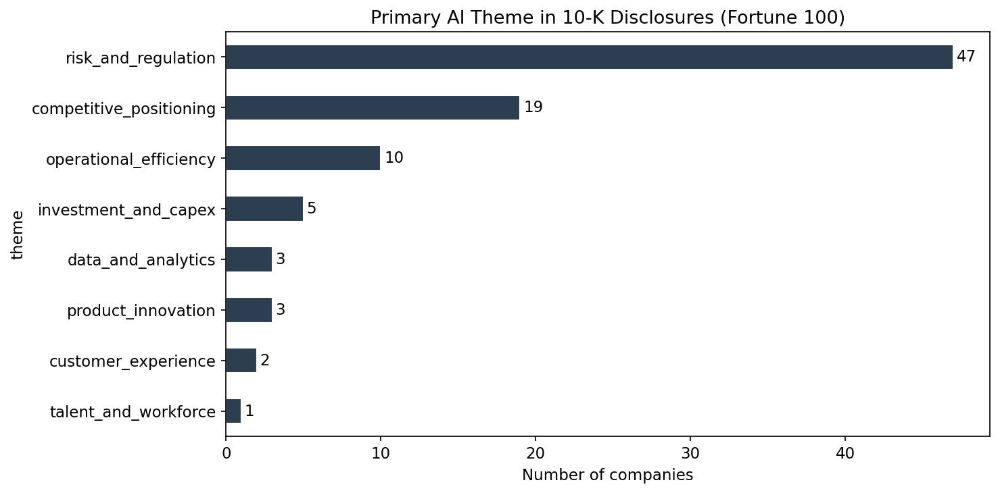
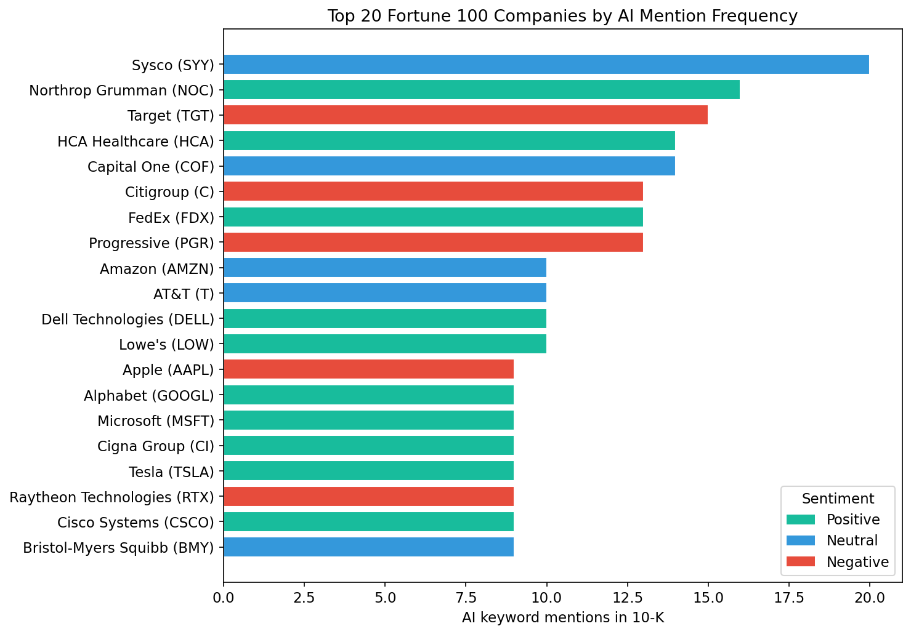

## The question

Artificial intelligence is everywhere in corporate discourse -- earnings calls, investor decks, annual reports. But what are companies actually saying when they write about AI in the document that carries the most legal weight?

We analyzed the most recent 10-K filing for each Fortune 100 company to find out: **when America's largest public companies discuss AI in their regulatory disclosures, do they frame it as an opportunity or a risk?**

## Scope

- **Universe:** Fortune 100 companies by revenue. Of these, 94 are public filers with retrievable 10-K filings from SEC EDGAR.
- **Filings:** The single most recent 10-K per company (filing dates range from early 2025 to February 2026).
- **Method:** We extracted passages containing AI-related terms (artificial intelligence, machine learning, deep learning, generative AI, predictive models, and related phrases), then classified the sentiment of those passages and identified the dominant theme of each company's AI discussion.

## Finding 1: AI is now a near-universal disclosure topic

Of 94 retrievable filings, **90 (96%) mention artificial intelligence** or closely related terms. This is not confined to the technology sector. Companies across healthcare, energy, retail, financials, and industrials all address AI in their annual reports.

The question for investors is no longer *whether* a company mentions AI, but *how* it frames the technology.



## Finding 2: The majority frame AI as a risk

Among the 90 companies that discuss AI:

| Sentiment | Companies | Share |
|-----------|-----------|-------|
| Negative (risk-focused) | 42 | 47% |
| Positive (opportunity-focused) | 32 | 36% |
| Neutral (factual) | 16 | 18% |

```{python}
import pandas as pd

try:
    import plotly.express as px
except ImportError:
    import subprocess, sys
    subprocess.check_call([sys.executable, "-m", "pip", "install", "plotly"])
    import plotly.express as px

df_results = pd.read_csv("/Users/radebe/Documents/ai-strategist/data/fortune_100_ai_sentiment_results.csv")

sentiment_colors = {"positive": "#18bc9c", "neutral": "#3498db", "negative": "#e74c3c"}
sentiment_counts = df_results["sentiment"].value_counts().reset_index()
sentiment_counts.columns = ["sentiment", "count"]

fig_sentiment = px.bar(
    sentiment_counts,
    x="sentiment",
    y="count",
    color="sentiment",
    color_discrete_map=sentiment_colors,
    title="AI Sentiment Across Fortune 100 (Latest 10-K)",
    hover_data=["count"],
)
fig_sentiment.update_layout(
    xaxis_title="Sentiment",
    yaxis_title="Number of companies",
    showlegend=False,
    margin=dict(t=60, l=50, r=20, b=40),
)

fig_sentiment
```

**Nearly half frame AI primarily through the lens of risk.** The language centers on regulatory uncertainty, cybersecurity threats, compliance costs, and competitive disruption.

The contrast between how different companies write about the same technology is instructive. Microsoft opens its 10-K by stating:

> "Microsoft is a technology company committed to making digital technology and artificial intelligence available broadly and doing so responsibly."

Apple, meanwhile, leads its AI discussion with a warning:

> "The introduction of new and complex technologies, such as artificial intelligence features, can increase these and other safety risks, including exposing users to harmful, inaccurate or other negative content and experiences."

Both are trillion-dollar technology companies. One frames AI as its corporate mission; the other introduces it as a source of risk. This divergence is even more pronounced across sectors.

## Finding 3: Sector determines the narrative

Technology companies are the clear outlier -- the vast majority frame AI positively, emphasizing competitive positioning and product strategy. Alphabet describes itself as "a pioneer in the development of artificial intelligence" and "since 2016, an AI-first company." Dell Technologies calls itself "a leader in the global technology industry focused on providing broad and innovative technology solutions for the data and artificial intelligence era." Nvidia discusses AI as the foundation of its entire product architecture.

Outside technology, the pattern reverses.

**Financials** lean heavily cautious. JPMorgan Chase warns that "if JPMorganChase does not keep pace with rapidly changing technological advances, including the adoption of generative AI, it risks losing clients and market share to competitors" -- but frames this primarily as a threat vector, noting that "new technologies (including generative AI) could be used by customers or bad actors in unexpected or disruptive ways." Bank of America, Citigroup, and Morgan Stanley adopt similar risk-first language.

**Healthcare** tilts negative among pharma and insurance companies, while providers like HCA Healthcare and CVS Health frame AI as an operational tool for care delivery and member experience.

**Industrials** are split along business-model lines. Defense contractors like Lockheed Martin and Northrop Grumman treat AI as a competitive capability. General manufacturers strike a different tone -- 3M's filing states bluntly: "The Company's use of artificial intelligence technologies exposes the Company to risks which could have a material adverse effect on the Company's business, reputation and results of operations."

**Retail** leans negative. Target writes that "generative artificial intelligence presents emerging ethical issues" and warns that "if our use of generative artificial intelligence becomes controversial or is inaccurate or ineffective, our reputation and competitive position could be adversely affected." Kroger, Home Depot, and Dollar General adopt similar framings.

**Energy** is predominantly risk-focused, centered on cybersecurity and operational exposure, with the exception of Chevron, which frames AI as a productivity tool.

The pattern is clear: **companies that build AI talk about it as opportunity; companies that consume it talk about it as risk.**

```{python}
import plotly.express as px

sector_sentiment = (
    df_results.groupby(["sector", "sentiment"])
    .size()
    .reset_index(name="count")
)

fig_sector = px.bar(
    sector_sentiment,
    x="count",
    y="sector",
    color="sentiment",
    color_discrete_map=sentiment_colors,
    orientation="h",
    title="AI Sentiment by Sector (Fortune 100)",
    hover_data=["sentiment", "count"],
)
fig_sector.update_layout(
    xaxis_title="Number of companies",
    yaxis_title="Sector",
    barmode="stack",
    margin=dict(t=60, l=120, r=20, b=40),
)

fig_sector
```



## Finding 4: Risk and regulation dominate the thematic landscape

Beyond positive-negative sentiment, we classified the primary theme of each company's AI discussion:

| Primary AI Theme | Companies |
|------------------|-----------|
| Risk and regulation | 47 |
| Competitive positioning | 19 |
| Operational efficiency | 10 |
| Investment and capex | 5 |
| Product innovation | 3 |
| Data and analytics | 3 |
| Customer experience | 2 |
| Talent and workforce | 1 |

**Over half of the Fortune 100 companies that mention AI do so primarily in the context of risk and regulation** -- cybersecurity threats amplified by AI, evolving regulatory frameworks around data privacy and algorithmic accountability, and the competitive risk of falling behind. Competitive positioning, a distant second, is driven almost entirely by technology firms.

Operational efficiency -- arguably the use case with the most immediate impact on margins -- ranks third, with only 10 companies. This is notable: either operational AI adoption is earlier-stage than the public narrative implies, or companies are not yet comfortable claiming AI-driven efficiency gains in a document subject to SEC scrutiny.

## Finding 5: AI intensity varies enormously

The depth of AI discussion ranges from companies that dedicate extensive passages to AI strategy and risk management to those that mention it once in passing.

The most AI-vocal companies include Sysco (AI in the context of operational transformation), Northrop Grumman (AI as a defense capability), Target (AI as a competitive and regulatory risk), HCA Healthcare (AI-driven care delivery), and Capital One (AI in financial services with significant regulatory framing). At the other end, ExxonMobil, Plains All American Pipeline, and Caterpillar mention AI only once or twice, typically in a general risk factor or market demand context.



## What this means

**The disclosure gap is a signal.** When a company frames AI exclusively as a risk in its 10-K but touts it as a growth driver on earnings calls, that divergence is worth investigating. The 10-K is the more conservative, legally scrutinized document. Investors should weight it accordingly.

**Sector context matters.** A negative sentiment score for a bank is a different signal than a negative score for a technology company. Financial services firms operate under regulatory frameworks that compel cautious language. The risk framing may reflect compliance culture as much as genuine strategic concern.

**The regulatory overhang is real.** The dominance of "risk and regulation" as the primary theme is not boilerplate. Companies are telling investors, in legally binding language, that they do not yet know the rules of the game -- how AI will be regulated, how liability will be allocated, how compliance costs will scale.

**Operational efficiency is underdisclosed.** Only 10 companies cite operational efficiency as their primary AI theme, despite it being the use case with the most measurable near-term impact on enterprise value. This gap between public AI enthusiasm and regulatory disclosure caution is itself a data point worth tracking over time.

## Methodology (brief)

1. **Company universe**: Start from the current Fortune 100 list by revenue, then drop entities without public 10-K filings (e.g., mutuals and private companies). This yields 94 public filers.
2. **Mapping to SEC identifiers**: Map each company to its SEC CIK using the `company_tickers.json` mapping from `sec.gov`, joined on ticker (uppercased and normalized).
3. **Filing retrieval**: For each CIK, call the SEC Submissions API (`data.sec.gov/submissions/CIK##########.json`) and select the **single most recent Form 10-K** (by filing date), capturing the accession number and primary document filename.
4. **Text extraction**: Construct the full filing URL on `sec.gov/Archives` from the CIK, accession number (without dashes), and primary document name. Fetch the HTML, strip tags, normalize whitespace, and split into sentences.
5. **AI-specific passages**: Identify sentences that contain AI-related terms (artificial intelligence, machine learning, deep learning, generative AI, large language models, and related phrases). For each hit, take a small window of surrounding sentences and concatenate them into an AI-focused text slice per company.
6. **Sentiment and theme classification**: Send each AI slice to an LLM for classification into one of {positive, neutral, negative} and a primary theme (risk and regulation, competitive positioning, operational efficiency, etc.), using a structured prompt and simple parsing to extract the label, theme, and rationale.
7. **Aggregation**: Aggregate the per-company labels and themes into the distributions shown above, and compute simple intensity metrics (e.g., AI-mention counts) for the charts.

---

*This analysis covers the Fortune 100 by revenue. Of these, 94 companies had retrievable 10-K filings from SEC EDGAR. Sentiment was classified using natural language processing applied to AI-specific passages extracted from each filing. If you’d like access to the full notebook and future methodology updates, [subscribe here](/subscribe.html) and you’ll receive them by email when they’re available.*
